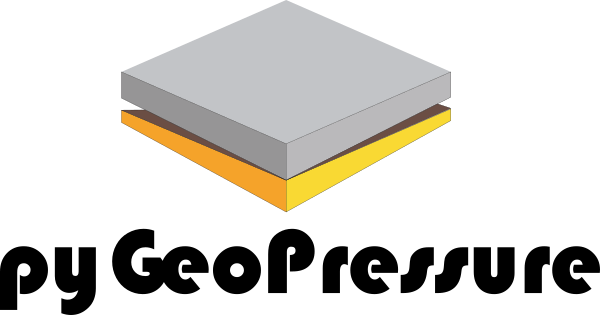
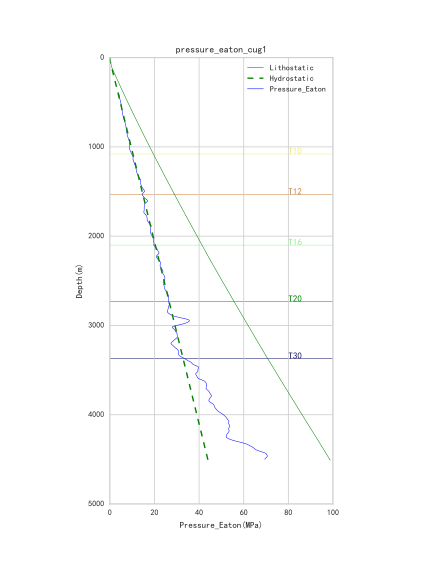

<!-- # pyGeoPressure -->


[](https://badge.fury.io/py/pyGeoPressure)
[](https://github.com/whimian/pyGeoPressure/releases)
[](https://github.com/whimian/pyGeoPressure/blob/master/LICENSE)
[](http://pygeopressure.readthedocs.io/en/latest/?badge=latest)
[](https://travis-ci.org/whimian/pyGeoPressure)
[](https://www.codacy.com/app/whimian/pyGeoPressure?utm_source=github.com&amp;utm_medium=referral&amp;utm_content=whimian/pyGeoPressure&amp;utm_campaign=Badge_Grade)
[](https://codecov.io/gh/whimian/pyGeoPressure)
[](https://doi.org/10.5281/zenodo.1452001)


A Python package for pore pressure prediction using well log data and seismic velocity data.


[](https://doi.org/10.21105/joss.00992)

Cite pyGeoPressure as:
> Yu, (2018). PyGeoPressure: Geopressure Prediction in Python. Journal of Open Source Software, 3(30), 992, https://doi.org/10.21105/joss.00992

BibTex:

```bibtex
@article{yu2018pygeopressure,
  title = {{PyGeoPressure}: {Geopressure} {Prediction} in {Python}},
  author = {Yu, Hao},
  journal = {Journal of Open Source Software},
  volume = {3},
  pages = {922}
  number = {30},
  year = {2018},
  doi = {10.21105/joss.00992},
}
```

# Features

1. Overburden (or Lithostatic) Pressure Calculation
2. Eaton's method and Parameter Optimization
3. Bowers' method and Parameter Optimization
4. Multivariate method and Parameter Optimization

# Getting Started

## Installation

`pyGeoPressure` is on `PyPI`:

```bash
pip install pygeopressure
```

## Example

### Pore Pressure Prediction using well log data

```python
import pygeopressure as ppp

survey = ppp.Survey("CUG")

well = survey.wells['CUG1']

a, b = ppp.optimize_nct(well.get_log("Velocity"),
                        well.params['horizon']["T16"],
                        well.params['horizon']["T20"])
n = ppp.optimize_eaton(well, "Velocity", "Overburden_Pressure", a, b)

pres_eaton_log = well.eaton(np.array(well.get_log("Velocity").data), n)

fig, ax = plt.subplots()
ax.invert_yaxis()

pres_eaton_log.plot(ax, color='blue')
well.get_log("Overburden_Pressure").plot(ax, 'g')
ax.plot(well.hydrostatic, well.depth, 'g', linestyle='--')
well.plot_horizons(ax)
```



# Documentation

Read the documentaion for detailed explanations, tutorials and references:
https://pygeopressure.readthedocs.io/en/latest/

# Contribute

## Report Bugs

If you find a bug, please report it at [Github Issues](https://github.com/whimian/pyGeoPressure/issues) by opening a new issue with `bug` label.

## Suggest Enhancements

If you have new ideas or need new features, you can request them by opening a new issue at [Github Issues](https://github.com/whimian/pyGeoPressure/issues) with `enhancement` label. We will see if we can work on it together.

## Submit Pull Requests

If you would like to help fix known bugs, please submit a PR.
(See [The beginner's guide to contributing to a GitHub project](https://akrabat.com/the-beginners-guide-to-contributing-to-a-github-project/), if you are new to Github).

Before creating a pull request, please try to make sure the tests pass and use numpy-style docstrings. (Please see the documentation on setting up the development environment https://pygeopressure.readthedocs.io/en/latest/install.html)

# Support

If you have any questions, please open an issue at [Github Issues](https://github.com/whimian/pyGeoPressure/issues) with `question` label. Tell us about your question, we will provide assistance. And maybe we could add it to the documentation.

# License

The project is licensed under the MIT license, see the file [LICENSE](<https://github.com/whimian/pyGeoPressure/blob/master/LICENSE>) for details.
